# MediQueue — Hospital OPD Queue Management System

> **Interview-ready project guide** — Backend-first deep dive with architecture, flows, and talking points.

---

## Project Overview

**MediQueue** is a **real-time hospital queue management system**.

It solves the problem of **long waiting lines** and **manual queue handling** in hospitals.

### 4 Modules

| # | Module | What it does |
|---|---|---|
| 1 | **Reception dashboard** | Register patients and generate tokens |
| 2 | **Doctor dashboard** | Call next, complete, or skip patients |
| 3 | **Admin panel** | Dashboard stats and staff overview |
| 4 | **Live display board** | Shows the live department queue in real time |

- **Reception** can register patients and generate tokens.
- **Doctors** can call next, complete, or skip patients.
- The **display board** shows the live department queue in real time.

### Flow (Simple)

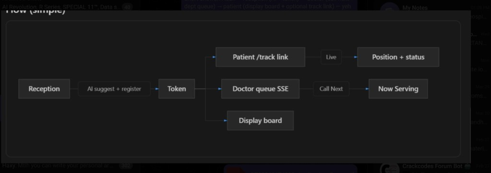

### Real-Time Synchronization

For real-time synchronization, I used:

- **Redis Pub/Sub**
- **Server-Sent Events (SSE)**

Whenever queue data changes:

```
Backend → Redis → SSE → all connected clients update instantly
```

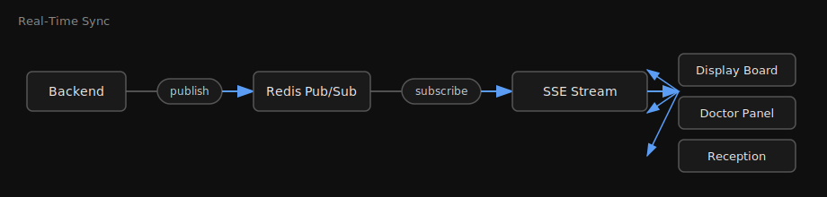

### Race Condition Handling

I handled race conditions using **Postgres transactions** and **advisory locks**, so two staff members cannot:

- Generate **duplicate tokens**
- Call the **same patient** simultaneously

### AI-Assisted Triage (Unique Feature)

One unique feature is **AI-assisted triage**.

Receptionists can enter patient symptoms, and **Gemini AI** suggests:

- **Department** (DENT, ORTH, CARD, NEUR, GEN)
- **Priority** (EMERGENCY, SENIOR, NORMAL)

This helps reduce manual mistakes and speeds up registration. If Gemini is unavailable, a **rule-based fallback** takes over automatically.

### Tech Stack

| Layer | Technologies |
|---|---|
| **Frontend** | Next.js, Tailwind CSS |
| **Backend** | Node.js, Express, TypeScript |
| **Database** | PostgreSQL, Drizzle ORM |
| **Real-time** | Redis |
| **AI** | Gemini API |

---

## H — Hook (What is this project?)

**MediQueue** is a digital **Out Patient Department (OPD) queue management system** for hospitals.

In real life, when you visit a hospital:
1. Reception takes your **name, age, and problem**
2. You get a **token number** (e.g. `DENT-003`)
3. A **display board** shows the waiting queue
4. The doctor **calls the next patient**
5. You can **track your token** — *"How many people are ahead of me?"*

This project replaces manual paper tokens with a full-stack software system — **reception, doctor, display board, admin dashboard, and patient tracking** — all connected in real time.

### 30-Second Elevator Pitch

> *"I built MediQueue — a hospital queue system where reception registers patients and gets AI-suggested department/priority, tokens are generated with priority-based ordering (Emergency > Senior > Normal), doctors call the next patient safely with database locks, and display boards update live via Redis pub/sub and Server-Sent Events — all on Node.js, PostgreSQL, and Next.js."*

---

## E — Explain (The Problem)

| Real Hospital Problem | Why It Hurts |
|---|---|
| Manual paper tokens | Confusion, lost tokens, no tracking |
| No priority system | Emergency patients wait behind normal cases |
| Display board updated manually | Staff overhead, stale information |
| Reception picks wrong department | Patient sent to wrong OPD queue |
| Patient has no visibility | *"Kitna wait karna padega?"* — nobody knows |

### Who Uses the System?

| Role | What They Do |
|---|---|
| **Reception** | Register patient, AI triage suggestion, issue token |
| **Doctor** | Call next patient, mark DONE or SKIPPED |
| **Display Board** | Live waiting queue on screen (no refresh) |
| **Patient** | Track token position in queue |
| **Admin** | Dashboard stats, staff overview |

---

## R — Resolve (How It Works)

### Tech Stack

```
Frontend (Next.js)  →  Backend (Express + TypeScript)  →  PostgreSQL
                              ↓
                           Redis (pub/sub)
                              ↓
                         SSE (live updates)
                              ↓
                         Gemini AI (triage)
```

| Technology | Purpose |
|---|---|
| **Node.js + Express** | REST API server |
| **TypeScript** | Type-safe backend code |
| **PostgreSQL** | Patients, tokens, users, logs |
| **Drizzle ORM** | Type-safe SQL queries |
| **Redis** | Pub/sub for queue update broadcasts |
| **SSE (Server-Sent Events)** | Live queue updates to browsers |
| **Google Gemini** | Suggest department & priority from complaint |
| **Zod** | Validate AI JSON responses |
| **Next.js** | Frontend (reception, doctor, display, admin, track) |
| **Tailwind CSS** | Frontend styling |

### System Architecture

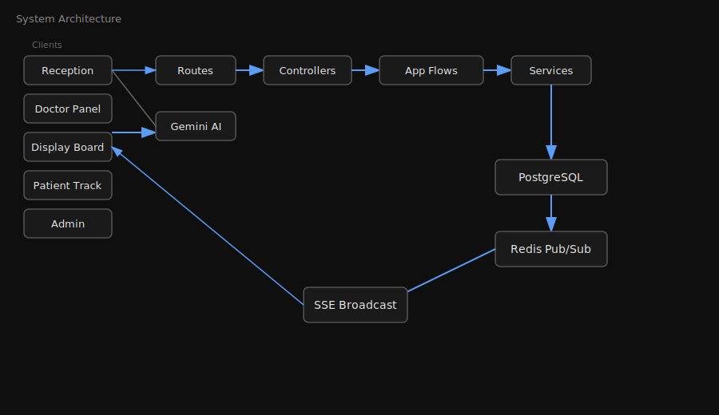

### Backend Layered Architecture

```
Routes  →  Controllers  →  Application Flows  →  Services  →  Database
```

| Layer | Responsibility | Example |
|---|---|---|
| **Routes** | Define URLs & HTTP methods | `patient.routes.ts` |
| **Controllers** | Parse request, send response | `patient.controller.ts` |
| **Application Flows** | Orchestrate business steps | `registerpatientflow.ts` |
| **Services** | DB ops & core logic | `queue.service.ts` |
| **Config** | DB, Redis, schema setup | `db.ts`, `schema.ts` |

### Database Schema

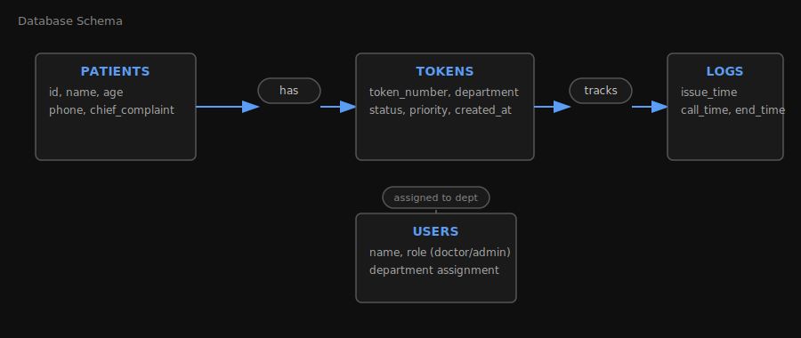

**Departments:** `DENT` · `ORTH` · `CARD` · `NEUR` · `GEN`

**Token Status Lifecycle:**

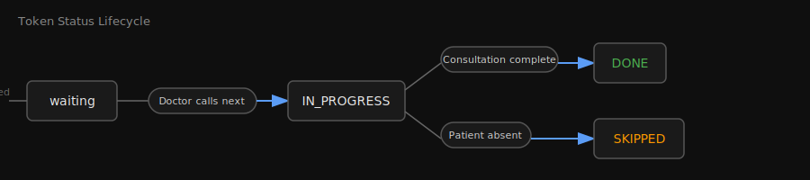

**Priority Order (highest first):**


---

### API Endpoints

#### Patient — `/patient`

| Method | Endpoint | Description |
|---|---|---|
| `POST` | `/patient/suggest` | AI suggests department & priority from complaint |
| `POST` | `/patient/register` | Register patient + generate token |

#### Token — `/token`

| Method | Endpoint | Description |
|---|---|---|
| `GET` | `/token/track/:tokenNumber` | Token status + position in queue |
| `POST` | `/token/generate` | Generate token for existing patient |

#### Queue — `/queue`

| Method | Endpoint | Description |
|---|---|---|
| `GET` | `/queue/waiting/:department` | Get waiting queue for department |
| `POST` | `/queue/call-next` | Doctor calls next patient |
| `POST` | `/queue/complete` | Mark token DONE or SKIPPED |
| `GET` | `/queue/stream/:department` | **Live SSE stream** for display board |

#### Admin — `/admin`

| Method | Endpoint | Description |
|---|---|---|
| `GET` | `/admin/stats` | Dashboard statistics |
| `GET` | `/admin/users` | List staff users |

---

### Core Flow 1 — Patient Registration

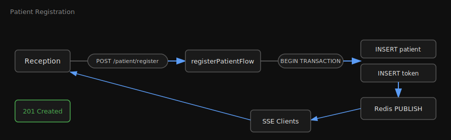

**Key file:** `backend/src/application/patient/registerpatientflow.ts`

**Interview point:** Patient and token are created in a **single database transaction** — if token generation fails, the patient insert is rolled back too.

---

### Core Flow 2 — Priority Queue Logic

The queue is **not simple FIFO**. It is a **weighted priority queue**:


**Sorting rules:**
1. `EMERGENCY` (score 3) — chest pain, breathing difficulty
2. `SENIOR` (score 2) — age 60+
3. `NORMAL` (score 1) — everyone else
4. Same priority → **first come, first served** (`createdAt`)

**Key file:** `backend/src/services/queue.service.ts` → `getQueue()`

---

### Core Flow 3 — Call Next Patient (Concurrency Safe)


**Interview gold point:** PostgreSQL **advisory lock** prevents race conditions — if two doctors click "Call Next" at the same time, the same patient is never called twice.

**Key file:** `backend/src/services/queue.service.ts` → `callNext()`

---

### Core Flow 4 — Real-Time Updates (Redis + SSE)

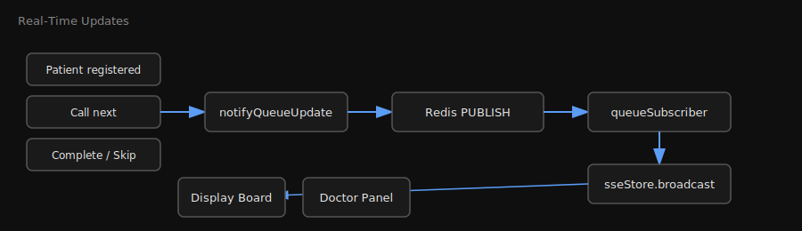

**Why Redis instead of direct SSE broadcast?**
- Decouples the API from connected clients
- Supports **multiple server instances** in production
- Clean pub/sub pattern

**Why SSE instead of WebSocket?**
- Updates are **one-way** (server → client only)
- Simpler to implement for display boards
- Works over standard HTTP

**Key files:**
- `backend/src/services/queue.service.ts` → `notifyQueueUpdate()`
- `backend/src/events/queueSubscriber.ts`
- `backend/src/utils/sseStore.ts`
- `backend/src/routes/queue.routes.ts` → `GET /stream/:department`

---

### Core Flow 5 — AI Triage (Gemini + Rule Fallback)

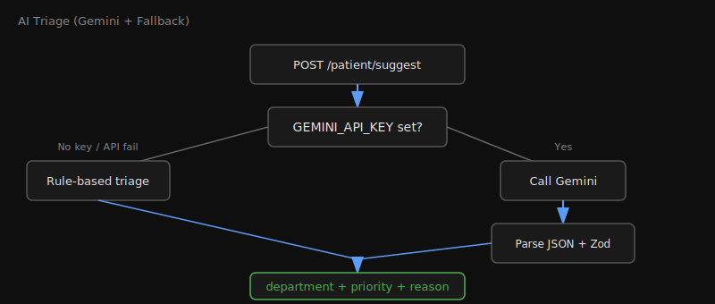

**Example input:**
```
"sir mein bahut dard hai, 65 saal ka hoon"
→ { department: "NEUR", priority: "SENIOR", reason: "..." }
```

**Fallback rules** (`backend/src/utils/triageRules.ts`):
- Regex patterns for Hindi + English keywords
- Emergency override: chest pain, breathless, unconscious
- Senior override: age ≥ 60
- Default department: `GEN`

**Interview point:** AI is a **routing assistant**, not a medical diagnosis tool. Rules always override AI for emergency cases.

---

### Token Number Generation

```
Format: {DEPARTMENT}-{NUMBER}
Examples: DENT-001, CARD-015, ORTH-003
```

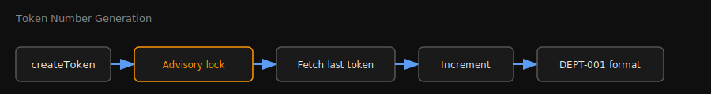

**Key file:** `backend/src/services/token.service.ts`

---

### Token Tracking

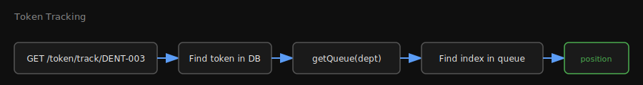

**Key file:** `backend/src/services/token.lookup.service.ts`

---

## O — Outcome (What You Built & Interview Points)

### Project Structure

```
MediQueue/
├── backend/
│   └── src/
│       ├── index.ts                  # Express app entry
│       ├── config/
│       │   ├── db.ts                 # PostgreSQL + Drizzle
│       │   ├── redis.ts              # Redis publisher
│       │   └── schema.ts             # DB tables
│       ├── routes/                     # API routes
│       ├── controllers/                # Request handlers
│       ├── application/                # Business flow orchestration
│       │   ├── patient/registerpatientflow.ts
│       │   └── token/generatetokenflow.ts
│       ├── services/                   # Core logic
│       │   ├── queue.service.ts        # Priority queue, call-next
│       │   ├── token.service.ts        # Token generation
│       │   ├── token.lookup.service.ts # Token tracking
│       │   ├── admin.service.ts        # Dashboard stats
│       │   └── gemini/                 # AI triage
│       ├── events/
│       │   └── queueSubscriber.ts      # Redis → SSE bridge
│       └── utils/
│           ├── sseStore.ts             # SSE client management
│           └── triageRules.ts          # Rule-based fallback
└── frontend/
    └── src/app/
        ├── reception/                  # Register patients
        ├── doctor/                     # Call next, complete
        ├── display/                    # Live queue board
        ├── track/[token]/              # Patient token tracker
        └── admin/                      # Dashboard
```

### End-to-End User Journey

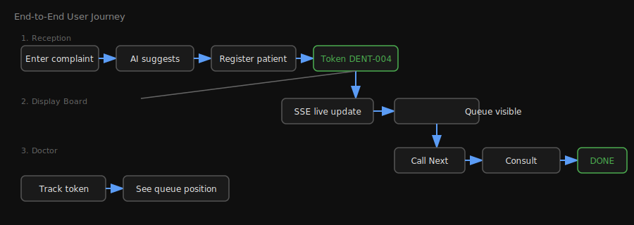

---

### Interview Q&A Cheat Sheet

#### Q: What was the most challenging part?
> Priority queue with concurrency safety. Two doctors could click "Call Next" simultaneously — I used **PostgreSQL advisory locks** inside a transaction so only one call-next succeeds per department at a time.

#### Q: How did you implement real-time updates?
> When the queue changes, the backend publishes to **Redis**. A subscriber listens and broadcasts to all **SSE-connected clients** (display boards). No polling, no page refresh.

#### Q: Why SSE over WebSocket?
> Updates are **one-directional** — server pushes queue data to display boards. SSE is simpler, works over HTTP, and is sufficient for this use case.

#### Q: What role does AI play?
> **Routing assistant only** — not diagnosis. Gemini reads the patient's complaint and suggests department + priority. Emergency keywords in rules **always override** AI output for safety.

#### Q: Where did you use database transactions?
> - Patient registration (patient + token together)
> - Token generation (with duplicate check)
> - Call next (lock + status update)
> - Complete token (status + log update)

#### Q: How does the priority queue work?
> Not FIFO — **weighted FIFO**. EMERGENCY (3) > SENIOR (2) > NORMAL (1). Within the same priority, earlier `createdAt` wins.

#### Q: How would you scale this?
> Redis pub/sub already supports multiple backend instances. `bullmq` is in dependencies for background jobs. JWT/bcrypt packages are ready for auth. Could add read replicas for PostgreSQL.

#### Q: What happens if Gemini API fails?
> Automatic **fallback to rule-based triage** — regex patterns for Hindi/English symptoms. System never goes down because of AI.

---

### Running Locally

```bash
# Backend
cd backend
npm install
# Set .env: DATABASE_URL, REDIS_URL, GEMINI_API_KEY (optional)
npm run dev          # starts on port 3001
npm run seed         # seed demo data

# Frontend
cd frontend
npm install
npm run dev          # starts on port 3000
```

### Environment Variables

| Variable | Required | Description |
|---|---|---|
| `DATABASE_URL` | Yes | PostgreSQL connection string |
| `REDIS_URL` | No | Defaults to `redis://127.0.0.1:6379` |
| `GEMINI_API_KEY` | No | Falls back to rule-based triage if missing |
| `PORT` | No | Backend port, defaults to `3001` |

---

### Key Design Decisions Summary

| Decision | Choice | Reason |
|---|---|---|
| Queue ordering | Priority + FIFO within tier | Emergency patients must not wait |
| Concurrency | PostgreSQL advisory lock | Prevent double call-next |
| Real-time updates | Redis pub/sub + SSE | Scalable, one-way push |
| AI triage | Gemini + rule fallback | Smart routing with guaranteed uptime |
| ORM | Drizzle | Type-safe, lightweight, SQL-like |
| Architecture | Layered (routes → flows → services) | Separation of concerns, testable |

---

*Built for learning and interview preparation. Backend-first, production-minded patterns.*
